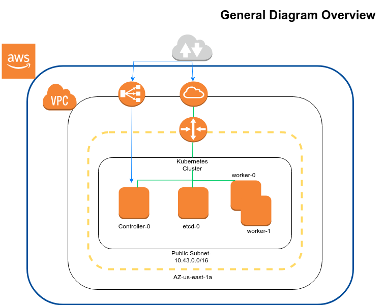

DevOps Coding Test
==================




For this Test the Infrastructure provisioning was implemented with Terraform and Kubespray was used to configure kubernetes cluster in which we are going to deploy our kubernetes-bootcamp app

Prerequisites:

Terraform (v0.11.10)
aws-cli   (aws-cli/1.15.14 Python/2.7.15rc1 Linux/4.15.0-43-generic botocore/1.10.14)
kubespray (https://github.com/kubernetes-incubator/kubespray)
ansible   (ansible 2.7.6)
python3   (to be able to run HEALTHCHECK SCRIPT)

AWS SETUP Steps

- Clone the following repo in your local directory:

```git clone https://github.com/shake76/devops-coding-challenge.git```

- Inside devops-coding-challengue/terraform directory run the following commands

```terraform init``` (Initialize the working directory containing Terraform configuration files) after it finished then run
```terraform plan``` (Show us the aws resources that are going to be created), if everithing looks good in terraform plan output we are ready to run ```terraform apply``` (it is going to create our infraestructure in AWS)

Note: One of the tf files inside terraform directory is sshcfg.tf, this resources is going to generate our ssh.cfg file that we are going to use later to connect to our instances.


KUBERNETES CLUSTER SETUP Steps

- Inside devops-coding-challengue/kubespray directory check the python dependencies

```pip3 install -r requirements.txt```

- Create an inventory/inventory.cfg file (here below you have the current one used for this test):

```[all]
ip-10-43-0-X.us-east-1.computer.internal ansible_host=PUBLIC_IP ip=10.43.0.X ansible_user=ubuntu ansible_python_interpreter=/usr/bin/python3
ip-10-43-0-X.us-east-1.computer.internal ansible_host=PUBLIC_IP ip=10.43.0.X ansible_user=ubuntu ansible_python_interpreter=/usr/bin/python3
ip-10-43-0-X.us-east-1.computer.internal ansible_host=PUBLIC_IP ip=10.43.0.X ansible_user=ubuntu ansible_python_interpreter=/usr/bin/python3
ip-10-43-0-X.us-east-1.computer.internal ansible_host=PUBLIC_IP ip=10.43.0.X ansible_user=ubuntu ansible_python_interpreter=/usr/bin/python3

[kube-master]
ip-10-43-0-X.us-east-1.computer.internal

[kube-node]
ip-10-43-0-X.us-east-1.computer.internal
ip-10-43-0-X.us-east-1.computer.internal

[etcd]
ip-10-43-0-X.us-east-1.computer.internal

[k8s-cluster:children]
kube-node
kube-master```

Note: you can take the PUBLIC_IP address from devops-coding-challengue/ssh.cfg file previously genereated with terraform

- Run the following command to provision your servers

```ansible-playbook -i inventory/inventory.cfg -b -v cluster.yml```

- After provision is successful you can login to the master instance and check if nodes are connected correctly

```kubectl get nodes``` (the output expected is the following)

NAME                                        STATUS   ROLES    AGE   VERSION
ip-10-43-0-x.us-east-1.computer.internal   Ready    master   30h   v1.13.2
ip-10-43-0-x.us-east-1.computer.internal   Ready    node     29h   v1.13.2
ip-10-43-0-x.us-east-1.computer.internal   Ready    node     29h   v1.13.2

DEPLOY APP

-Deploying kubernetes-bootcamp app in kubernetes-cluster, create the following template.yml file that also contain the service

```# template.yml
apiVersion: apps/v1
kind: Deployment
metadata:
  name: kubernetes-bootcamp
  labels:
    app: kubernetes-bootcamp
spec:
  replicas: 2
  selector:
    matchLabels:
      app: kubernetes-bootcamp
  template:
    metadata:
      labels:
        app: kubernetes-bootcamp
    spec:
      containers:
      - name: kubernetes-bootcamp
        image: gcr.io/google-samples/kubernetes-bootcamp:v1
        ports:
        - containerPort: 8080

---
apiVersion: v1
kind: Service
metadata:
  name: kubernetes-bootcamp
spec:
  selector:
    app: kubernetes-bootcamp
  type: NodePort
  ports:
  - port: 80
    targetPort: 8080
    nodePort: 30206
    protocol: TCP```

- Once our template is created we are ready to run the following command to create our deployment and service:

```kubectl create -f template.yml``` then we are ready to check if the pods are running correctly ```kubectl get pods``` (the output expected is the following)

NAME                                   READY   STATUS    RESTARTS   AGE
kubernetes-bootcamp-865f4c5f68-7rjfv   1/1     Running   0          22h
kubernetes-bootcamp-865f4c5f68-g5s2k   1/1     Running   0          22h


- Finally we are going to check if our app deployed is up and running

``` curl -v http://kubernetes-412530889.us-east-1.elb.amazonaws.com:30206``` you can check it out from the browser if needed

RUN HEALTHCHECK SCRIPT (it is in order to monitoring the endpoint status)

```python3.6 healthcheck.py```


